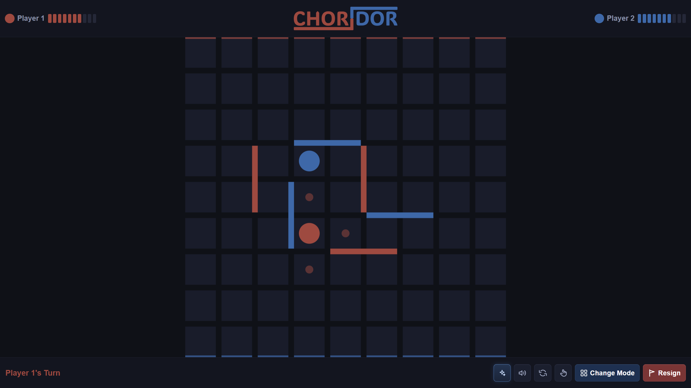

<p align="center">
    
</p>

<p align="center">
    <strong>A web implementation of Quoridor with local, online, and Discord multiplayer.</strong>
</p>

<p align="center">
    <a href="https://joavn.dev/choridor">Play</a>
    |
    <a href="https://discord.com/discovery/applications/1515199692793843712">Discord Activity</a>
    |
    <a href="https://github.com/JoachimVN/CHORIDOR-web/issues">Issues</a>
    |
    <a href="https://github.com/JoachimVN/CHORIDOR-web/pulls">Pull Requests</a>
    |
    <a href="https://github.com/JoachimVN/CHORIDOR-web/commits/main">Commits</a>
</p>

CHORIDOR is a web implementation of Quoridor, which is a two-player strategy board game played on a 9×9 grid. Each player races to reach the opposite side of the board while placing walls to block their opponent's path. Walls must never completely seal off a player's route, keeping every game solvable until the final move.

The desktop version is available at [JoachimVN/CHORIDOR](https://github.com/JoachimVN/CHORIDOR).

## Screenshots

<p align="center">
    
    <br>
    <em>In-game board</em>
</p>

## Features

- Pawn moves with jump logic, wall placement with path-check enforcement
- **Local multiplayer** — two players on the same device
- **Online multiplayer** — create a room, share a 3-character code, play with a friend anywhere
- **Discord Activity** — play directly inside a Discord voice channel with Rich Presence
- **Spectating queue** — players can watch an ongoing game and are promoted automatically when a player leaves
- Dark-slate themed board with legal-move dot indicators and hover-preview for walls
- Confirm mode for touch devices, board flip, animations, and sound effects
- Win overlay with rematch support and Discord Rich Presence

## CHORIDOR Desktop

The desktop version ([JoachimVN/CHORIDOR](https://github.com/JoachimVN/CHORIDOR)) is built with Java and JavaFX and ships as a native app. This web version trades depth for accessibility and multiplayer. More features might be added later for web version.

<table>
  <tr>
    <th align="center" width="33%">Desktop only</th>
    <th align="center" width="33%">Web only</th>
  </tr>
  <tr>
    <td valign="top">
      Human vs AI opponents<br>
      AI vs AI simulation<br>
      Live AI tournament with mini-boards<br>
      Game review mode<br>
    </td>
    <td valign="top">
      Online multiplayer<br>
      Discord Activity<br>
      Spectator queue<br>
      Plays in any browser, no install<br>
    </td>
  </tr>
</table>

## Tech Stack

| Layer | Tech |
|---|---|
| Frontend | Vanilla HTML, CSS, Canvas API |
| Backend | Node.js, Express, Socket.IO |
| Frontend hosting | Vercel |
| Backend hosting | Railway |
| Discord Activity | Discord Embedded App SDK |

## Project Structure

```
CHORIDOR-web/
├── frontend/
│   ├── index.html
│   ├── js/game.js
│   ├── css/style.css
│   ├── audio/sfx/
│   ├── fonts/
│   └── images/
└── backend/
    └── server.js
```

## Running Locally

**Backend**
```bash
cd backend
npm install
npm run dev       # starts on localhost:3001
```

**Frontend** — open `frontend/index.html` with Live Server (VS Code) or:
```bash
npx serve frontend
```

The frontend auto-detects `localhost` / `127.0.0.1` and connects to the local backend.
