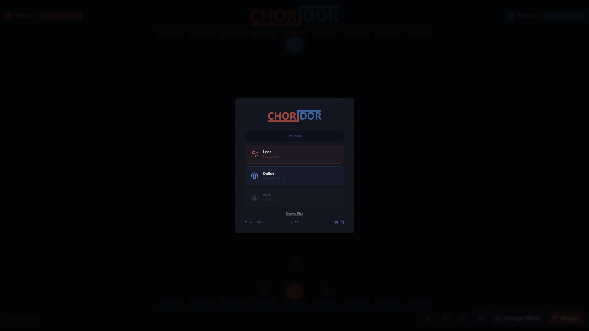

<p align="center">
    
</p>

<p align="center">
    <strong>A web implementation of Quoridor with local and online multiplayer.</strong>
</p>

<p align="center">
    <a href="https://joavn.dev/choridor">Play</a>
    |
    <a href="https://github.com/JoachimVN/CHORIDOR-web/issues">Issues</a>
    |
    <a href="https://github.com/JoachimVN/CHORIDOR-web/pulls">Pull Requests</a>
    |
    <a href="https://github.com/JoachimVN/CHORIDOR-web/commits/main">Commits</a>
</p>

CHORIDOR is a web implementation of Quoridor — a two-player strategy board game played on a 9×9 grid. Each player races to reach the opposite side while placing walls to block their opponent's path. Walls must never completely seal off a player's route, keeping every game solvable until the final move.

The desktop version is available at [JoachimVN/CHORIDOR](https://github.com/JoachimVN/CHORIDOR).

## Screenshots

<p align="center">
    
    <br>
    <em>In-game board</em>
</p>

<p align="center">
    
    <br>
    <em>Mode selection</em>
</p>

<p align="center">
    
    <br>
    <em>Win screen</em>
</p>

## Features

- 9×9 board with full Quoridor rules — pawn moves, jump logic, wall placement, BFS path-check enforcement
- **Local multiplayer** — two players on the same device
- **Online multiplayer** — create a room, share a 3-character code, play with a friend anywhere
- Flip board button to swap perspectives
- Mute button
- Sound effects for moves, jumps, walls, and wins
- Responsive canvas that fills the viewport and scales correctly at any browser zoom level

## Tech Stack

| Layer | Tech |
|---|---|
| Frontend | Vanilla HTML, CSS, Canvas API |
| Backend | Node.js, Express, Socket.IO |
| Frontend hosting | Vercel |
| Backend hosting | Railway |

## Project Structure

```
CHORIDOR-web/
├── frontend/
│   ├── index.html
│   ├── js/game.js
│   ├── css/style.css
│   ├── audio/sfx/
│   ├── fonts/
│   └── images/
└── backend/
    └── server.js
```

## Running Locally

**Backend**
```bash
cd backend
npm install
npm run dev       # starts on localhost:3001
```

**Frontend** — open `frontend/index.html` with Live Server (VS Code) or:
```bash
npx serve frontend
```

The frontend auto-detects `localhost` / `127.0.0.1` and connects to the local backend.
